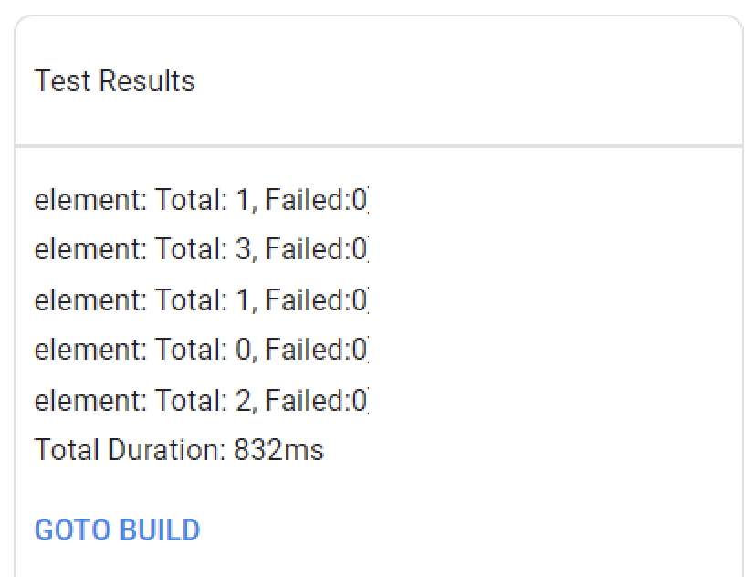

# newman-reporter-gchat

A Newman reporter to Google Chat with a card message.

 

## 🚥 Pre-requisites

Create Google Chart [webhook](https://developers.google.com/chat/how-tos/webhooks#define_an_incoming_webhook).


## 🏗️ Install
```
npm install
```

## 🧰 Build
```
npm pack
```
This will create a tarball. Then to use it in your project, you must run:
```
npm install newman-reporter-gchat-1.0.0.tgz
```

## 🚀 Usage

Add to the Newman run command:
```
--reporters gchat --reporter-gchat-webhook-url <webhookUrl>
```

## ⚙️ Reporter Options
Available options are:
- `--reporter-gchat-webhook-url <url>`  
The Google Chat webhook url

- `--reporter-gchat-title <title>`  
Title to displays on the card message

- `--reporter-gchat-build-url <url>`  
link behind the button "GOTO BUILD"


## 🔗 Links

- https://learning.postman.com/docs/running-collections/using-newman-cli/newman-custom-reporters/
- https://developers.google.com/chat/api/guides/message-formats/cards
